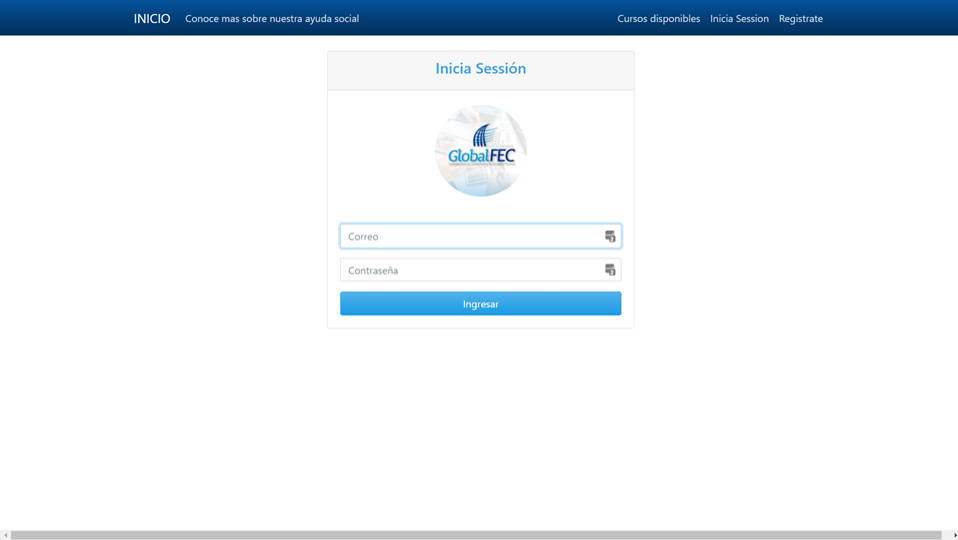
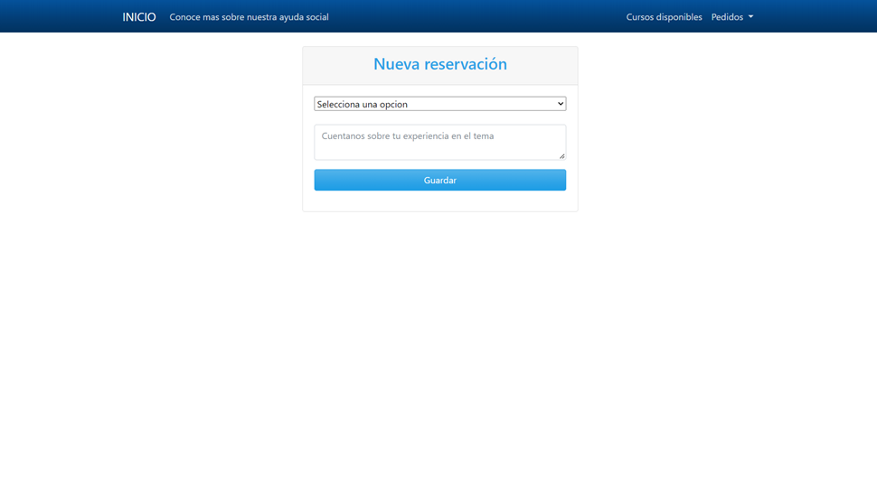

# `LA POSADA DE MINDO   `

### Tecnologias utilizadas

- Bootstrap - Frontend;
- API - Coingecko api de criptomonedas;
- NPM  - Manejador de paquetes de javascript ;
- MONGODB - Base de datos no relacional

------------

## Available Scripts

puedes ejecutar los siguientes comandos para arrancar la app:

### `npm run`

### `npm run dev`
------------
## Librerias utilizadas

-   "bcryptjs": "^2.4.3",
-    "cloudinary": "^1.28.1",
-    "connect-flash": "^0.1.1",
-    "ejs": "^2.7.1",
-    "express": "^4.17.1",
-    "express-handlebars": "^6.0.3",
-    "express-session": "^1.16.2",
-    "fs-extra": "^8.1.0",
-    "method-override": "^3.0.0",
-    "mongoose": "^5.13.12",
-    "morgan": "^1.9.1",
-    "multer": "^1.4.2",
-    "passport": "^0.4.0",
-    "passport-local": "^1.0.0",
-    "timeago.js": "^4.0.0-beta.2",
-    "uuid": "^3.3.3"
------------
# `PAGINACIONES`
------------
## INICIO

## CLOUDINARY PAGE
### Se ha integrado por medio del uso de las librerias multer, mongodb y la API de cloudinary para permitir al usuario subir imagenes.

## INICIO DE SESSIÓN
### Gracias a las librerias de passport bryptjs se ha creado un apartado de registro e inicio de session.

## PAGINA DE RESERVACION
### Una ves inciado sessión se habilita el apartado de reservación para que el usuario pueda registrarse y separar un cupo para los cursos.

------------

